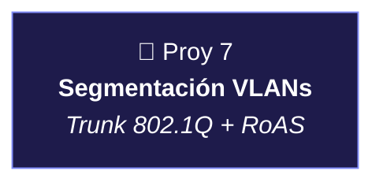
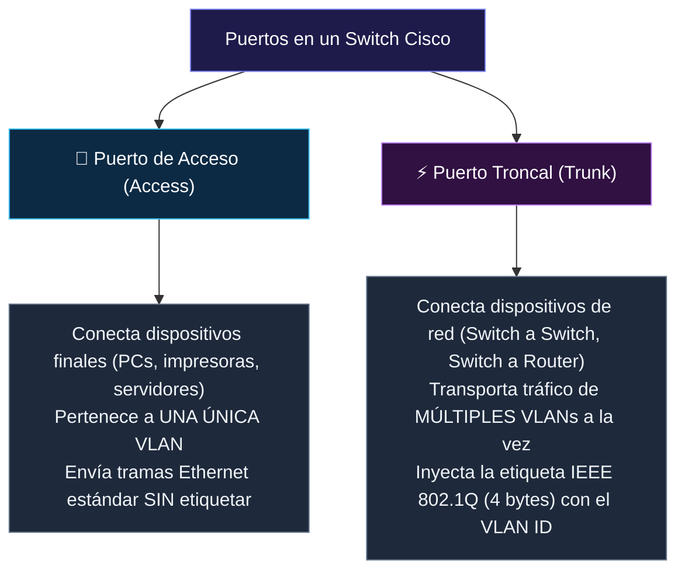

#sistemas-informaticos #packet-tracer #redes #laboratorio #ccna #cisco #networking #vlans #enrutamiento

> [!abstract] 🧭 Centro de Mando: Laboratorio de Proyectos Intermedios de Packet Tracer
> En este centro de mando documento mi laboratorio de **Proyectos Intermedios en Cisco Packet Tracer**.
> 
> Tras dominar los fundamentos básicos (conexión directa, switches planos, routers básicos, DHCP y Wi-Fi), en este bloque abordo arquitecturas de red avanzadas que reflejan fielmente los entornos corporativos reales: **segmentación mediante VLANs, enlaces troncales (Trunking 802.1Q), enrutamiento inter-VLAN con Router-on-a-Stick, listas de control de acceso (ACLs), redundancia y protocolos de enrutamiento dinámico**.
> 
> En cada proyecto documento el caso de uso de negocio, el objetivo práctico, la tabla de direccionamiento completa, la explicación técnica a bajo nivel y los comandos Cisco IOS paso a paso.

---

---

## 📚 Índice de Proyectos del Laboratorio Intermedio

| # | Proyecto | Archivo / Enlace | Conceptos Clave | Topología |
|:---:|:---|:---|:---|:---|
| **07** | **Segmentación de Redes (VLANs y Router-on-a-Stick)** | [[🔀 07 - Segmentación de Redes. VLANs, Trunking y Enrutamiento (Router-on-a-Stick)]] | Aislamiento L2 con VLANs, enlace Trunk 802.1Q (4 bytes tag), subinterfaces virtuales en router, enrutamiento inter-VLAN. | 4 PCs + 1 Switch 2960 + 1 Router ISR 4321 |

---

## 📸 Galería Visual de Topologías en Packet Tracer

### 🔀 Proyecto 07: Segmentación de Redes (VLANs y Router-on-a-Stick)

![[PT_Proyecto_07_VLANs_Router_on_a_Stick.png]]

---

## 🧠 Conceptos Esenciales del Nivel Intermedio

### 1. Puertos de Acceso (*Access*) vs. Puertos Troncales (*Trunk*)

---

### 2. ¿Qué es Router-on-a-Stick (RoAS)?

Es una técnica de diseño de red que permite realizar **enrutamiento inter-VLAN** utilizando una sola interfaz física de router conectada a un switch mediante un enlace troncal:

* **Sin Router-on-a-Stick:** Si tienes 10 VLANs, necesitas 10 cables físicos y 10 interfaces en el router (inviable y carísimo).
* **Con Router-on-a-Stick:** Usas **1 solo cable físico**. El router crea subinterfaces lógicas (`g0/0/0.10`, `g0/0/0.20`, etc.), cada una configurada con encapsulación `dot1Q <vlan-id>` y actuando como la puerta de enlace predeterminada de su respectiva subred.

---

### 3. Comandos Esenciales de Diagnóstico y Verificación

| Comando | Dónde se ejecuta | ¿Qué compruebo? |
| :--- | :--- | :--- |
| `show vlan brief` | Switch | Lista de todas las VLANs activas y qué puertos físicos tienen asignados. |
| `show interfaces trunk` | Switch | Qué puertos están en modo troncal, qué protocolo usan (`802.1q`) y qué VLANs tienen permitido el paso. |
| `show ip interface brief` | Router | Estado de las interfaces físicas y subinterfaces virtuales (`up / up`) y sus direcciones IP. |
| `show ip route` | Router | Tabla de enrutamiento; confirma si las subredes de las VLANs aparecen como directamente conectadas (`C`). |

---
→ Volver al repositorio de proyectos: [[📂Proyectos Básicos/🌐 README|📁 Ver Proyectos Básicos (01 al 06)]]
